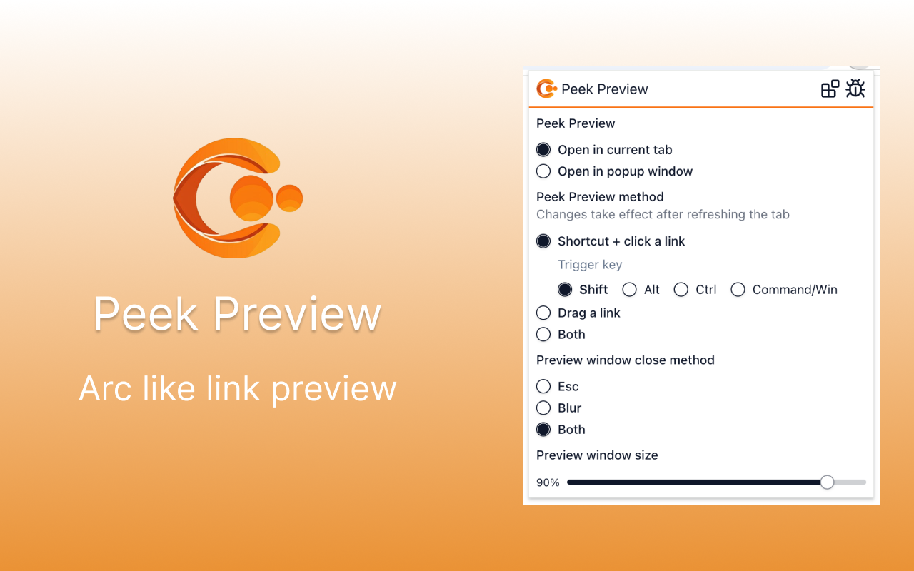
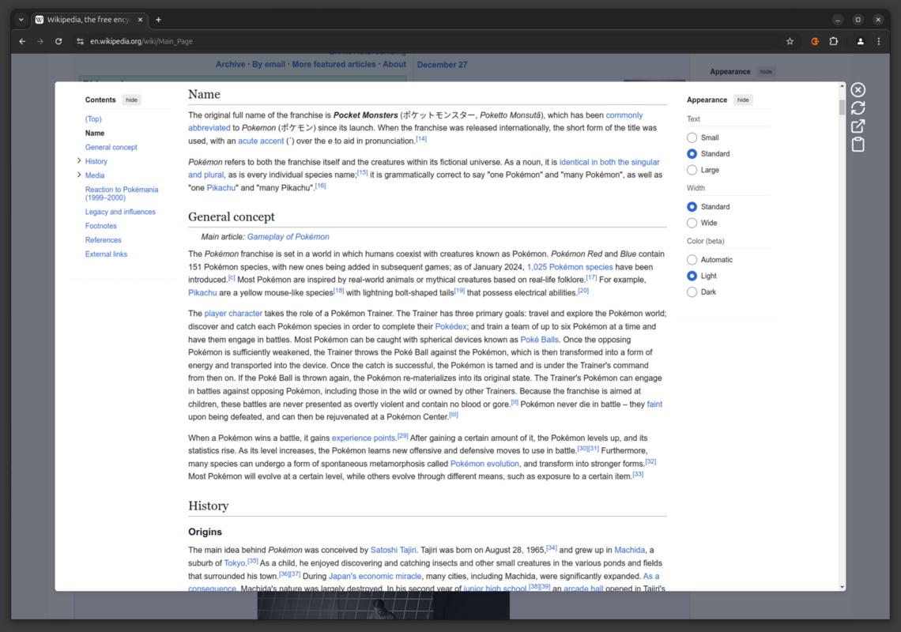
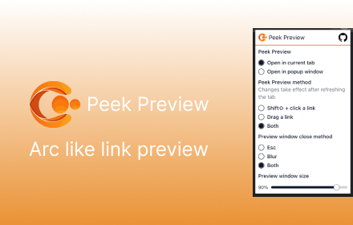
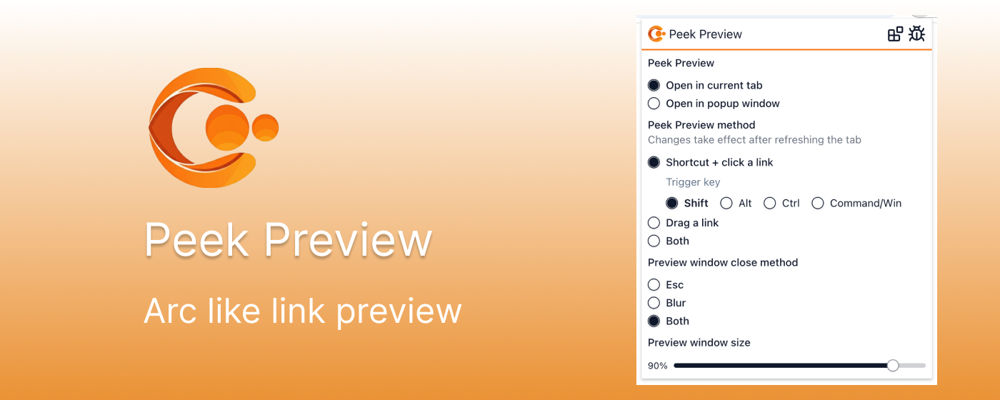

# Store listing

## Title

Peek Preview

## Summary from package

Peek Preview - Arc like peek preview for your web browser

## Description

Create by tomowang with ❤️ <https://tomo.dev>

Features:

1. Preview links in current tab or popup window
2. Use shift⇧ + click link or drag link to open links for peek preview
3. Press Esc or just blur the preview window to close it

Known issues:

1. Some websites may not work properly due to `onfetch` handler of service workers
2. Some websites disable the drag event or shift⇧ + click event, so you can't use them to open links for peek preview
3. Links may not work properly when they redirect to another sites which have Content Security Policy (CSP) enabled

Open source on GitHub: <https://github.com/tomowang/peek-preview>

## Category

Tools

## Language

English

## Store icon

## Promo Video

https://youtu.be/s3XLsu8M1LY

## Screenshots

## Small promo tile

## Marquee promo tile

# Privacy

## Single purpose

Shift⇧ click or drag link to open link in popup window instead of new tab

## Permission justification

-   Storage permission is required to store settings
-   Host permission is required to run content scripts on all websites

## Data usage

None
